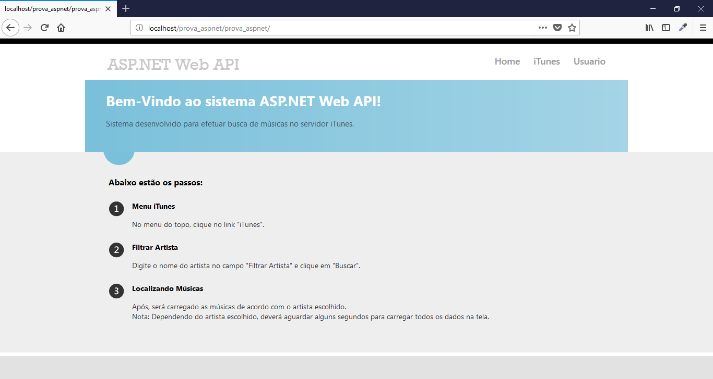
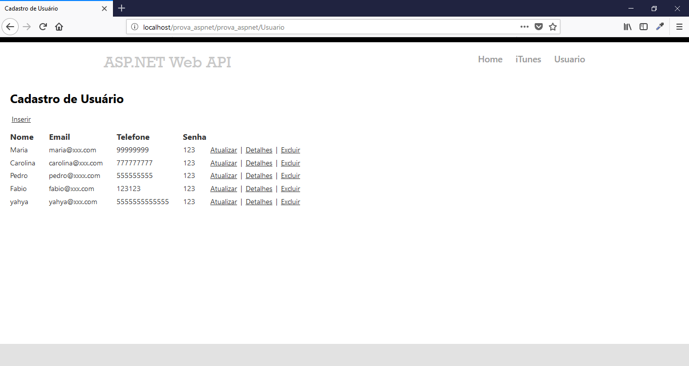
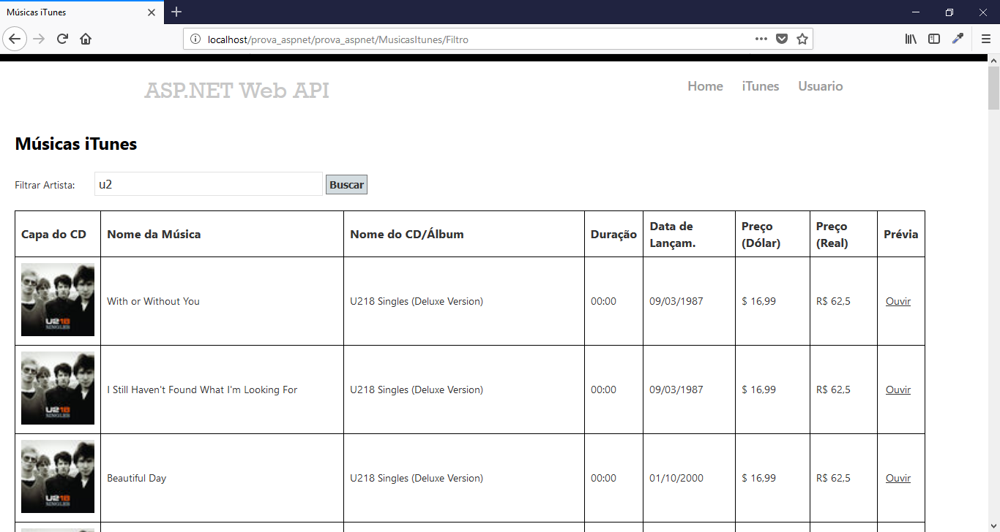

# Manual de Instalação

## Prova Asp.Net - Interauge RH

## Sistema Músicas iTunes

1 - Configure o arquivo "AcessoBancoDados.cs" dentro do diretório "prova_aspnet/prova_aspnet/DAO".

	1.1 - Configure as opções seguintes:
		private string server = "localhost";
        	private string user = "root";
        	private string password = "";
        	private string database = "prova_aspnet";

2 - Dados para se logar no sistema:

	2.2 - Usuário: Pedro
	      Senha: 123

3 - Configurando o banco de dados

	3.1 - Execute o arquivo "prova_itunes.sql".

		Para criar o banco de dados do sistema entre no phpMyAdmin, vá em SQL, 
		copie o texto que está dentro do "prova_itunes.sql"
		cole dentro da caixa de texto que irar aparecer e aperte executar.

		Ou crie o banco e clique em importar e envie o arquivo.

## Tecnologias Usadas:

C# 
ASP.NET 4.5
WEB API (RESTful)
MYSQL 5.6.12

## License

Laravel Admin is licensed under <a href="license.md">The MIT License (MIT)</a>.

## Screenshots

  
  
  
